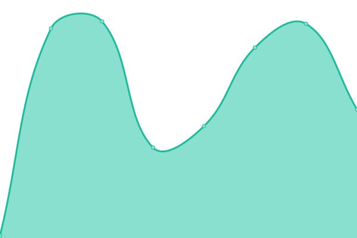

# [📈 Live Status](https://Adsenser.github.io/upptime): <!--live status--> **🟩 All systems operational**

[**Status website →**](https://Adsenser.github.io/upptime)

<!--start: status pages-->
<!-- This summary is generated by Upptime (https://github.com/upptime/upptime) -->
<!-- Do not edit this manually, your changes will be overwritten -->
<!-- prettier-ignore -->
| URL | Status | History | Response Time | Uptime |
| --- | ------ | ------- | ------------- | ------ |
|  [스팟 다모앗](https://spot.damoat.com/) | 🟩 Up | [.yml](https://github.com/Adsenser/upptime/commits/HEAD/history/.yml) | 

 1110ms
     
 | 

<a href="https://Adsenser.github.io/upptime/history/">100.00%</a>
    

|  [주소 API](https://madefor.github.io/postal-code-api/api/v1/350/1106.json) | 🟩 Up | [api.yml](https://github.com/Adsenser/upptime/commits/HEAD/history/api.yml) | 

 84ms
     
 | 

<a href="https://Adsenser.github.io/upptime/history/api">100.00%</a>
    

<!--end: status pages-->
