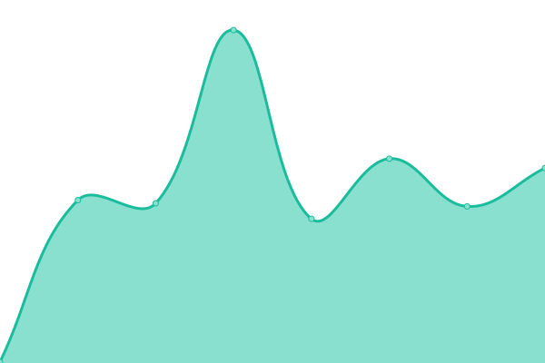
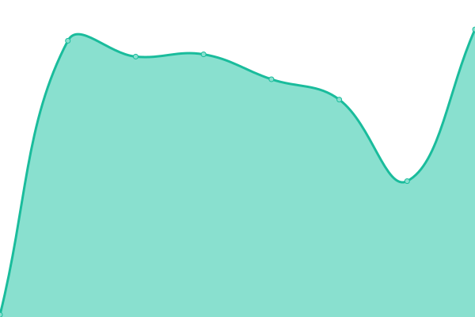

# [📈 Live Status](https://Adsenser.github.io/upptime): <!--live status--> **🟩 All systems operational**

[**Status website →**](https://Adsenser.github.io/upptime)

<!--start: status pages-->
<!-- This summary is generated by Upptime (https://github.com/upptime/upptime) -->
<!-- Do not edit this manually, your changes will be overwritten -->
<!-- prettier-ignore -->
| URL | Status | History | Response Time | Uptime |
| --- | ------ | ------- | ------------- | ------ |
|  [spot.damoat CF Pages](https://spot.damoat.com/) | 🟩 Up | [spot-damoat-cf-pages.yml](https://github.com/Adsenser/upptime/commits/HEAD/history/spot-damoat-cf-pages.yml) | 

 178ms
     
 | 

<a href="https://Adsenser.github.io/upptime/history/spot-damoat-cf-pages">100.00%</a>
    

|  [spot.damoat API server](https://api-spot.damoat.com/server.php?initial=true) | 🟩 Up | [spot-damoat-api-server.yml](https://github.com/Adsenser/upptime/commits/HEAD/history/spot-damoat-api-server.yml) | 

 1152ms
     
 | 

<a href="https://Adsenser.github.io/upptime/history/spot-damoat-api-server">100.00%</a>
    

|  [jusho API server](https://madefor.github.io/postal-code-api/api/v1/350/1106.json) | 🟩 Up | [jusho-api-server.yml](https://github.com/Adsenser/upptime/commits/HEAD/history/jusho-api-server.yml) | 

 71ms
     
 | 

<a href="https://Adsenser.github.io/upptime/history/jusho-api-server">100.00%</a>
    

<!--end: status pages-->
